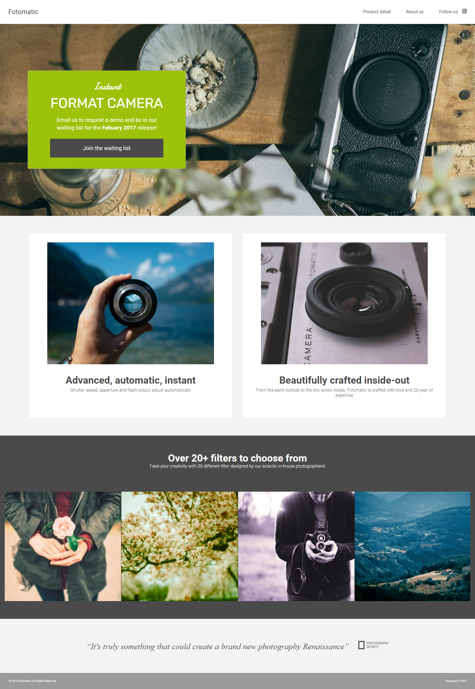

# Off-Platform Project (CodeCademy): Fotomatic

[Fixed Project](https://armand-sa.github.io/Fotomatic-Project/) **- Screenshot below:**

___

## Fix a broken version of a responsive website in this project!

In this project, you will fix a broken version of a responsive website called Fotomatic. You will be provided with specs to help guide you in making adjustments to the broken code. To get started, download the broken code and the [design specs](https://static-assets.codecademy.com/Paths/full-stack-career-journey/Fotomatic/fotomatic_spec_landing_v2.png?_gl=1*k3roiz*_gcl_aw*R0NMLjE3MjExMTU5MDEuQ2p3S0NBand0TmkwQmhBMUVpd0FXWmFBTkhjSnBIQnJBZEd1dGVPUG5laFpwaVdjaXhUcmJYSXkwS3VXTTE0RVV6Y2RodnhrbmwtaHZSb0N1X0lRQXZEX0J3RQ..*_gcl_au*MTU4MDYwOTc5MC4xNzIwNjA0ODU4*_ga*MTc4MTczMjIzMC4xNzIxMTE1MTc5*_ga_3LRZM6TM9L*MTcyMzAxMzA2OS41My4xLjE3MjMwMTU4ODQuMzkuMC4w)! You can also see a working version of the [final product](https://static-assets.codecademy.com/Paths/full-stack-career-journey/Fotomatic/final/index.html?_gl=1*coobvh*_gcl_aw*R0NMLjE3MjExMTU5MDEuQ2p3S0NBand0TmkwQmhBMUVpd0FXWmFBTkhjSnBIQnJBZEd1dGVPUG5laFpwaVdjaXhUcmJYSXkwS3VXTTE0RVV6Y2RodnhrbmwtaHZSb0N1X0lRQXZEX0J3RQ..*_gcl_au*MTU4MDYwOTc5MC4xNzIwNjA0ODU4*_ga*MTc4MTczMjIzMC4xNzIxMTE1MTc5*_ga_3LRZM6TM9L*MTcyMzAxMzA2OS41My4xLjE3MjMwMTU0MTkuMzYuMC4w).

As you fix Fotomatic’s bugs, remember to use the skills you acquired in the Chrome DevTools article to help you decipher and update the site’s CSS. Chrome DevTools are essential for debugging – they allow you to view current style values, toggle rules, and test different rule values.

